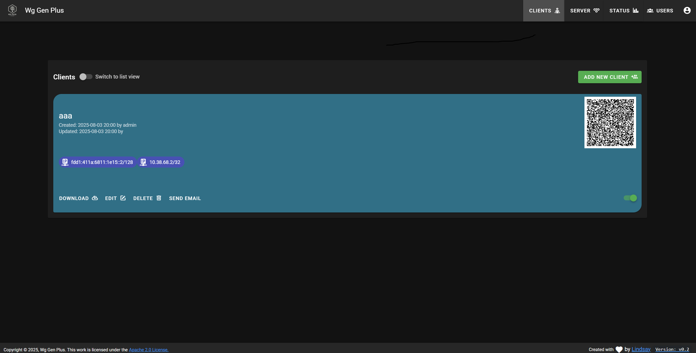

# Wg Gen Plus

<h1 align="center"></h1>

A web-based [WireGuard](https://wireguard.com) config generator — because you deserve nice things.

## Why Wg Gen Plus ?

I’ve recently started dabbling with WireGuard as a new tool in my VPN kit for those times when I can live without OpenVPN’s kitchen-sink configurability in exchange for the raw speed WireGuard brings to high-bandwidth connections.

Most of the WireGuard UI tools I came across were either frustratingly basic—missing even the most essential features for something like a site-to-site VPN—or wildly over-engineered monstrosities stuffed into Docker containers, trying to do everything including running their own full-blown VPN server in a container.

What I really wanted was something simple, clean, and practical: a tool that could be packaged as a single Debian Linux package, dropped in alongside WireGuard, and still offer the same flexibility and ease of configuration I’ve come to expect from OpenVPN.

While exploring the world of WireGuard management tools, I came across [Wg-Gen-Web](https://github.com/vx3r/wg-gen-web). It had a clean, straightforward interface and was a great starting point—but it didn’t quite meet my needs for site-to-site VPNs, and like many projects these days, it came bundled in a Docker container, even though the actual functionality didn’t really need it.

So, I decided to build on its solid foundation and made Wg-Gen-Plus, a simple Wireguard management UI that runs as a simple binary, while having the power to manage Wireguard VPN servers servers—covering everything from typical user-to-server VPN setups to full-on site-to-site VPN network bridges.

## Features

 * Self-hosted and web based
 * Automatically select client IP from the network pool assigned to the server
 * QR-Code for convenient mobile client configuration
 * Send email to client with QR-code and client config
 * Single click Enable / Disable clients
 * Regenerate and auto-reload of Wireguard server configuration after any modification
 * IPv6 ready
 * Suitable for both User to Server and Server to Server (Site-to-site) VPN configuration
 * UI user authentication (Local and Oauth2 OIDC)
 * The UI has two access levels: regular users can manage peers, while admins can manage both peers and users.
 
<h1 align="center"></h1>

## Usage

Until I get around to building this as a .deb package, there is a basic installation script to install this.
PLEASE NOTE! THIS SCRIPT HAS ONLY HAS MINIMAL TESTING ON DEBIAN LINUX 12 (BOOKWORM) AND DEBIAN LINUX 13 (TRIXIE)

The script does the follwing things
1. Creates the required directories
2. Copies the executables into /opt/wg-gen-plus
3. Copies a default configuration file into /etc/wg-gen-plus
4. Creates and enables a systemd service to autostart Wg-Gen-Plus at system boot
5. Starts the Wg-Gen-Plus service to create a default wg0 Wireguard configuration file in /etc/wireguard
6. Enables the the wg-quick service to autostart wg0 at boot
7. Copies the wg-api executable to /opt/wg-api
8. Creates and enabled a Systemd service to autostart wg-api at boot

Installation instructions for Debian Linux 12 Bookworm, and Debian Linux 13 Trixie
1. Install Wireguard `sudo apt install wireguard`
2. Clone the Wg-Gen-Plus repository `git clone https://github.com/vk2amv/wg-gen-plus.git`
3. Change to the directory `cd wg-gen-plus`
4. Run installation script `sudo ./install.sh`
5. (OPTIONAL) If you want to change settings from the defaults, eg to configure SMTP server settings, edit the configuration file in the directory `/etc/wg-gen-plus/wg-gen-plus-wg0.conf`
6. Access the web interface using your web browser `http://serveraddress:8080` on first run Wg-Gen-Plus creates an admin user with a randomly generated password. Until I improve the implementation, you need to check your logs for the generated admin password.

Use the command `journalctl -u wg-gen-plus.service` to view the logs of the Wg-Gen-Plus service after first startup and look for lines similar to this example below
```
No users found. Creating default admin user...
Generated admin password: ^CBkPG$0KjLD
Default admin user created:
Username: admin
Password: ^CBkPG$0KjLD
Please change this password after logging in!
```

## Configuration file options
```
# IP address to bind to
SERVER=0.0.0.0
# port to bind
PORT=8080

# Where to write Wireguard server generated config file
WG_CONF_DIR=/etc/wireguard
# WireGuard interface name to use, generally wg0
WG_INTERFACE_NAME=wg0

# Where to store Wg-Gen-Plus database file
DB_FILE_DIR=/var/lib/wg-gen-plus

# Auth type to use, local, oauth or noauth
# This option is currently broken, only local auth works, to be fixed in future relase
AUTH_TYPE=local

# Wireguard server hooks to run on server up and server down (Optional)
SERVER_PREUP_HOOK="logger WireGuard wg0 PreUp"
SERVER_POSTUP_HOOK="logger WireGuard wg0 PostUp"
SERVER_PREDOWN_HOOK="logger WireGuard wg0 PreDown"
SERVER_POSTDOWN_HOOK="logger WireGuard wg0 PostDown"

# Command to execute on server config update (Optional)
SERVER_RELOAD_CMD="/usr/bin/wg syncconf wg0 <(wg-quick strip wg0)"

# https://github.com/jamescun/wg-api integration, user and password (basic auth) are optional
WG_STATS_API=http://127.0.0.1:8081
#WG_STATS_API_TOKEN=
#WG_STATS_API_USER=
#WG_STATS_API_PASS=

# SMTP settings to send email to clients
SMTP_HOST=mail.smtp2go.com
SMTP_PORT=2525
SMTP_USERNAME=
SMTP_PASSWORD=
SMTP_FROM=Wg Gen Plus <wg-gen-plus@127-0-0-1.au>

# example with authentik, which is RFC implementation and no need any custom stuff (Currently broken)
OAUTH2_PROVIDER_NAME=oauth2oidc
OAUTH2_PROVIDER=https://authentik.127-0-0-1.au
OAUTH2_CLIENT_ID=
OAUTH2_CLIENT_SECRET=
OAUTH2_REDIRECT_URL=https://wg-gen-plus-demo.127-0-0-1.au

# set provider name to fake to disable auth (Currently broken)
OAUTH2_PROVIDER_NAME=fake

# Gin framework release mode, set to debug for full debug messages
#GIN_MODE=release
```
## Automatically apply changes to WireGuard using SERVER_RELOAD_CMD

Wg-Gen-Plus supports running an external command when you update the server configuration file, eg when adding or removing clients, or enabling or disabling clients.

You can specify the command to run using the SERVER_RELOAD_CMD variable.

WARNING! This is currently running the command as root user on your system.
I will improve this in future releases, but for now be careful about what command you put for that variable.
I strongly recommend you keep it to the minimal command to reload the Wireguard peers configuration.

## Network rules and packet routing

This implementation only generates configuration and reloads the Wireguard server configuration, its up to you to setup firewalling and packet routing.
My preference is to use [Shorewall](https://shorewall.org/index.html) for firewalling and packet routing duties.

Shorewall is a zone based firewall for Linux systems.
The Wireguard interface is added as another zone to Shorewall, and then it is managed like any other network interface.

## WireGuard Status Display

Wg Gen Plus integrates a [WireGuard API implementation](https://github.com/jamescun/wg-api) to display client stats.
The provided install script will automatically setup wg-api with minimal settings to allow the status display to work.

If you wish the modify the wg-api settings (eg you intend to run Wg-Gen-Plus on a different server to the actual Wireguard server) Yesthe config file supports modifying these options
```
# https://github.com/jamescun/wg-api
WG_STATS_API=http://<API_LISTEN_IP>:8081

# Optional: Token Auth
WG_STATS_API_TOKEN=

# Optional: Basic Auth
WG_STATS_API_USER=
WG_STATS_API_PASS=
```
To setup the WireGuard API take a look at [https://github.com/jamescun/wg-api/blob/master/README.md](https://github.com/jamescun/wg-api/blob/master/README.md)

## User auth options

It is intended one day that you will be able to use both Local and OAUTH2 authentication options.
At the time of typing this, I have not done any testing with OAUTH2 authentication, and I believe it would be broken.

The local authentication option has 2 access levels for users, admin and non admin.
Non admin users can create and edit peers, edit server options, view the status page however they cannot edit other users in the users page.
Admin users have full access to create and delete users in the users page.

## Issues and Bugs

Most likely many bugs and logs of issues.
However at least basic functionality is working now.

I don't think OAUTH is working at the moment as I have not had time to test it since adding the local auth option to the code, and reading back through some of my changes I think I broke it.

Also the local auth implementation is not anything I would consider secure.
It is most likely riddled with security holes, so do not expose this management interface to the open internet under any circumstances unless you put it behind a reverse proxy with an access control implementation like [Knocknoc](https://knocknoc.io/)

The auth implementation is intended to provide a minimal level of user control only.

## Future plans

I plan to come back around to make sure OAUTH2 works.

Also I want to build proper Debian .deb package files for both X86-64 and ARM64 to both improve the installation experience and to allow this to be be run on a Raspberry Pi.

Currently I am running this as a root user service, this really is unnessary so I want to change the Systemd units to run as a minimal permission wg-gen-plus user.

I am sure there are lots more improvements to be made, and I will work through them as I think of them.

## Need Help
* Please create an issue for any bugs or improvement suggestions

## Development

### Backend
```
cd src/backend
go run cmd/wg-gen-plus/main.go
```

### Frontend
```
$ cd src/frontend
$ npm install
$ VUE_APP_API_BASE_URL=http://localhost:8080/api/v1.0 npm run serve
```

## Manually build packages

### Backend
```
mkdir -p ./build
cd src/backend
GOOS=linux GOARCH=amd64 go build -o wg-gen-plus-linux-amd64 -ldflags="-X wg-gen-plus/version.Version=v0.1" -o ../../build/wg-gen-plus ./cmd/wg-gen-plus
```

### Frontend
```
cd src/frontend
npm install
npm run build
mv ./ui ../../build
```

## Application stack

 * [Gin, HTTP web framework written in Go](https://github.com/gin-gonic/gin)
 * [go-template, data-driven templates for generating textual output](https://golang.org/pkg/text/template/)
 * [Vue.js, progressive javaScript framework](https://github.com/vuejs/vue)
 * [Vuetify, material design component framework](https://github.com/vuetifyjs/vuetify)


## License
Copyright 2025 Lindsay Harvey - https://github.com/vk2amv

   Licensed under the Apache License, Version 2.0 (the "License");
   you may not use this file except in compliance with the License.
   You may obtain a copy of the License at

       http://www.apache.org/licenses/LICENSE-2.0

   Unless required by applicable law or agreed to in writing, software
   distributed under the License is distributed on an "AS IS" BASIS,
   WITHOUT WARRANTIES OR CONDITIONS OF ANY KIND, either express or implied.
   See the License for the specific language governing permissions and
   limitations under the License.
